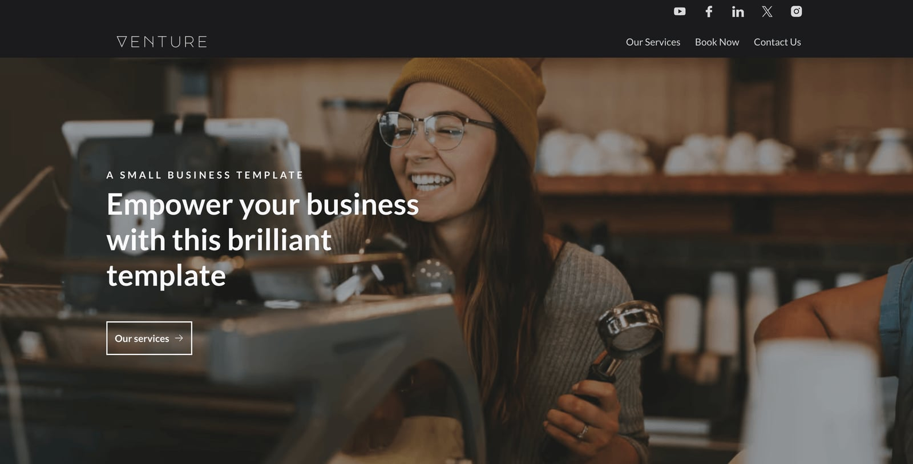

# Venture

Venture is a polished, marketing website template for Eleventy. Browse through a [live demo](https://spiky-polar.cloudvent.net).



[](https://app.cloudcannon.com/register/#sites/connect/github/cloudcannon/venture-eleventy-template)

## Features

- Pre-built pages
- Pre-styled components
- Configurable navigation and footer
- Multiple hero options
- Configurable form, gallery, image, video, pricing, left/right block, and more components
- Generic "Embed" component for custom embeds
- Configurable theme colors
- Configurable fonts
- Optimized for editing in CloudCannon
- Responsive layouts

## Editing

Venture is set up for adding, updating and removing pages, components, navigation and footer elements in [CloudCannon](https://app.cloudcannon.com/).

There is no blog or posts collection — Venture is a marketing site template, not a publishing one.

Changes in the data files require the site to be rebuilt to see your changes.

### Nav/footer details

- Reused around the site to save multiple editing locations.
- Set in the *Data* / *Nav* and *Data* / *Footer* sections
- Changes in these files are not reflected in live editing - you must save to see the changes in page building

### SEO details and favicon

- Favicon and site SEO details are set in the *Data* / *SEO* section
- Page SEO details are set in the frontmatter for each page (if they aren't set the site SEO details are used by default)

### Theme colors and fonts

- Theme colors and fonts can be set in *Data* / *Theme*
- The colors will update on the next build
- More font options can be added in *Data* / *Fonts*

## Setup

Get a workflow going to see your site's output (with [CloudCannon](https://app.cloudcannon.com/) or locally).

## CloudCannon agent skills

If you're working on this template with an AI coding agent, install CloudCannon's
[agent skills](https://github.com/CloudCannon/agent-skills) first — they cover configuration,
structures, snippets and Visual Editor support.

They are **deliberately not committed** to this repo. Skills are updated upstream, and a stale copy
checked into a template is worse than none at all, so install them fresh:

```bash
npx skills add CloudCannon/agent-skills
```

That installs into `.agents/`. To pick individual skills:

```bash
npx skills add CloudCannon/agent-skills --list
npx skills add CloudCannon/agent-skills --skill cloudcannon-configuration
```

If you use Claude Code, you can install them as a plugin instead:

```
/plugin marketplace add CloudCannon/agent-skills
/plugin install agent-skills@cloudcannon
```

Plugin skills are namespaced, e.g. `agent-skills:cloudcannon-configuration`.

## Editor documentation

`.cloudcannon/README.md` is written for non-technical editors using this site in CloudCannon. Worth
updating alongside any change to the components or data files.

## Development

**Requires Node.js 22 or newer.** Eleventy Image v7 is ESM-only and sets the floor at Node 22;
Sass and Sharp need 20.19+ and 20.9+ respectively. CloudCannon builds this template on Node 24
(set in `.cloudcannon/initial-site-settings.json`), so matching that locally is the safest bet.

1. Run `npm i` to install the modules.
2. Run `npm run start` to build and watch the site.

This will create a `_site` folder, containing the output files.
Any changes made to source files updates these output files.
By default the site's output files are hosted at `http://localhost:8080`

## Building

1. Run `npm i` to install the modules.
2. Run `npm run build` to build the site.

This will create a `_site` folder, containing the output files.

## Editing Locally with CloudCannon

Run CloudCannon against your local files with the [CloudCannon CLI](https://cloudcannon.com/documentation/developer-reference/cli/)
dev server. This is the fastest way to iterate on `cloudcannon.config.yml`, inputs, and structures —
you see the editing experience without committing and pushing first.

1. Install the CLI and log in (requires Node.js 24+):

   ```bash
   npm install --global @cloudcannon/cli
   cloudcannon login
   ```

2. Build the site, so the dev server has output to serve:

   ```bash
   npm run build
   ```

3. Start CloudCannon locally, pointing it at the build output:

   ```bash
   cloudcannon dev _site
   ```

The dev server runs on port `10101` by default and opens CloudCannon in your browser, pointed at the
files in this repo. Content edits sync to disk as you make them; re-run the build after changing
components or templates to refresh the preview.

Before you commit configuration changes, validate them:

```bash
cloudcannon validate
```

The dev server is a development tool only — editors never access it. See
[Build your editing experience locally](https://cloudcannon.com/blog/build-your-editing-experience-locally-with-the-cloudcannon-dev-server/)
for the full workflow.

## Components

Venture is built from plain Eleventy Liquid partials in `src/_includes/components/`, wired for
CloudCannon's Visual Editor with [`@cloudcannon/editable-regions`](https://cloudcannon.com/documentation/articles/using-editable-regions/).

Each component lives in its own folder, named after the component, holding all of its files:

```
components/sections/price-list/
├── price-list.liquid
├── price-list.scss
└── price-list.cloudcannon.structure-value.yml
```

The include path therefore repeats the name — `components/sections/price-list/price-list`.

Those folders are grouped by the structure the component belongs to, because CloudCannon collects
structure values by directory glob:

| Directory | Structure | Contents |
| --- | --- | --- |
| `components/sections/` | `content_blocks` | Page-builder sections |
| `components/heroes/` | `hero_blocks` | Page heroes |
| `components/form/` | `form_blocks` | Form inputs (sub-parts in `form/parts/`) |
| `components/icons/` | `icon_blocks` | Icon components |
| `components/assets/` | `asset_blocks` | Image and video |
| `components/layout/` | — | Shared layout partials, no structure |
| `components/generic/`, `components/simple/` | — | Shared building blocks |

### Adding a component

1. Add `my-component/my-component.liquid` (and an optional `my-component/my-component.scss`) to the
   right directory. The SCSS index is regenerated automatically by `npm run component-styles`.
2. Add `my-component.cloudcannon.structure-value.yml` beside it, in the same folder. Its
   `value._type` must be the component's include path (e.g.
   `components/sections/my-component/my-component`) — that same string is used as `data-component`
   and by `includeWith`, and all three must match.
3. Nothing to register: the directory glob (`components/sections/*/*.cloudcannon.structure-value.yml`)
   picks the structure up, and the editable-regions browser bundle resolves any component by include
   path.

### Editable regions

Sections are re-rendered in the editor from their stored data, which means a component's props must
be exactly the object at one data path. Partials that meet that bar (`heading`, `image`, `card`, …)
carry bare, self-relative `data-prop` values and are wrapped in a `data-editable="component"` region
by their caller. Shared layout partials that take a reshaped mix of fields (`layout/left-right-block`)
instead receive already-rendered editable markup from the section as captured HTML.

`ENV_CLIENT` is true only inside the editor bundle; use it to guard anything that can't run in the
browser (image optimisation, SVG inlining).

## Forms

You can use the "Form" component to create a form with a range of inputs. This component is set up to submit to a CloudCannon inbox as long as you configure the inbox key following the instructions below. If you want to integrate your custom form with custom submission actions you can use the "Embed" component.

- Create an inbox for your organisation/site following [these instructions](https://cloudcannon.com/documentation/articles/creating-an-inbox-to-receive-your-forms/) - note down the key that you use
- Connect your site to your inbox following [these instructions](https://cloudcannon.com/documentation/articles/connecting-your-site-to-an-inbox/)
- Add a "Form" and "Form Builder" component
- Add your inbox key to the relevant field in the form builder

The "Form" component has validation and error messages build in.

## Image optimization

The site uses the [eleventy image plugin](https://www.11ty.dev/docs/plugins/image/) to optimize your images.

Image caching is already configured: `.cloudcannon/initial-site-settings.json` ships with the
preserved paths set to `node_modules/,_site/optimized/`, so a new site only re-optimizes images that
have actually changed. You do not need to set this up by hand.

If you are connecting an existing site and want to check it, go to *Site Settings* → *Configuration*
→ *Caching options* and confirm `node_modules/,_site/optimized/` is listed.

Source photography is kept at 1600px wide, which is the largest size `eleventy-img` generates —
anything larger is discarded at build time and only slows the first build down. Resize your own
images before committing them.

See [this blog](https://cloudcannon.com/blog/automatically-optimize-your-images-with-eleventy-image-and-cloudcannon/) for more on optimizing images with Eleventy and CloudCannon.

## Embedding content

- The "Embed" component is built to be generic and support any embed, however we cannot guarantee it will work seamlessly with all embeddable content.
- We recommend using other components to check if they can meet your requirements first.
- We have successfully tested the following embeds:
    - Google forms
    - Hubspot forms
    - Instagram
    - Spotify
    - X (formerly Twitter)
    - Google docs
    - YouTube video (although we would recommend using the "Centered Large Asset" component with a video instead)
    - Lottie files
    - PDFs

All options in the above list (except YouTube videos) require you to use the "Embed" component.

## Accessibility

We have made efforts to prioritize accessibility in our design, but we acknowledge that it may not be perfect. Your feedback is valuable to us, so please feel free to share any suggestions or concerns to help us improve accessibility further.

## Component links

All blocks have an id field that can be set and then used as a link to that component.

This is helpful (for example) if you want to link to information about your services from the nav without having a fully seperate page for it. You can set the id field in the services block to be `services` and then in *Data* / *Nav* you can have a link to `#services`.

### Prebuild

There is a prebuild step with this template to process the user-defined theme variables (such as `color_groups` or `fonts`, defined in `src/_data/theme.yml`) and create associated CSS variables. The file which does this processing is located at `utils/fetch-theme-variables.js`.

When developing locally, you can run `$ npm run fetch-theme-variables` to execute the preprocessing.
This command runs automatically as part of `$ npm run start` and `$ npm run build`.

## Photography

Demo photography is from [Unsplash](https://unsplash.com) and listed in
[`src/assets/images/CREDITS.md`](src/assets/images/CREDITS.md). Replace it with your own before
launching — it is placeholder content, not a licence to reuse.
